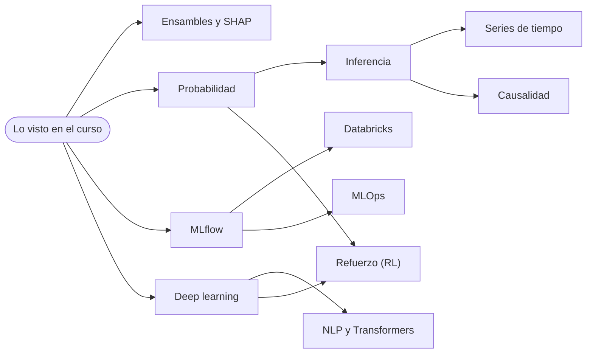

# Hoja de ruta para seguir después del curso

Viste clasificación, clusterización y regresión, con validación cruzada e hiperparámetros al final.
Esta ruta ordena en tres fases lo que sigue: la base estadística, las herramientas para llevar
modelos a producción y las especializaciones que mencionamos al cierre de la clase.

> Versión interactiva (filtro por perfil y progreso): abre `hoja-de-ruta/hoja_de_ruta.html` en tu navegador.

## Mapa de dependencias

Una flecha significa "conviene hacerlo antes".

---

## Fase 1 — Cimientos: estadística y mejores modelos tabulares
*Primeros 3 a 4 meses.*

### Probabilidad  ·  ~un semestre, 5 h/semana
- **Conexión con el curso:** la regresión logística entrega probabilidades; ROC y AUC, el sesgo y la varianza y DBSCAN se apoyan en distribuciones, esperanza y varianza.
- **Recursos:**
  - [Harvard Stat 110 (Joe Blitzstein)](https://stat110.net/), videos, gratis
  - *Introduction to Probability*, Blitzstein y Hwang (libro)
  - [Khan Academy: probabilidad y estadística](https://es.khanacademy.org/math/statistics-probability), repaso ligero
- **Mini-proyecto:** simula con numpy la distribución del R² de test de tu regresión al cambiar la semilla 1.000 veces y describe su forma.
- **Requiere:** nada.

### Inferencia estadística  ·  ~8 a 12 semanas
- **Conexión con el curso:** responde "¿esta diferencia entre dos modelos es real o suerte?"; justifica intervalos de confianza, p-valores de coeficientes y bootstrap (ISL cap. 3 y 5).
- **Recursos:**
  - *All of Statistics*, Larry Wasserman (libro)
  - *Statistical Inference*, Casella y Berger (libro, nivel avanzado)
  - Coursera: *Inferential Statistics* (Duke)
  - [Statistical Rethinking (McElreath)](https://xcelab.net/rm/), enfoque bayesiano, gratis
- **Mini-proyecto:** con el dataset de Taiwan, calcula un intervalo de confianza bootstrap del RMSE de tu mejor modelo y compáralo con el del baseline.
- **Requiere:** Probabilidad.

### Ensambles y explicabilidad (SHAP)  ·  ~3 a 5 semanas
- **Conexión con el curso:** Random Forest y XGBoost ya son ensambles. Aquí sigues con LightGBM, CatBoost y *stacking*, y aprendes a explicar cada predicción, algo que exige la regulación en crédito.
- **Recursos:**
  - [Kaggle Learn: Intermediate Machine Learning](https://www.kaggle.com/learn), gratis
  - [*Interpretable Machine Learning* (Molnar)](https://christophm.github.io/interpretable-ml-book/), libro gratis
  - Documentación de [SHAP](https://shap.readthedocs.io/) y [LightGBM](https://lightgbm.readthedocs.io/)
- **Mini-proyecto:** reentrena el score de crédito con LightGBM y genera un gráfico SHAP que explique por qué se rechaza a un cliente concreto.
- **Requiere:** lo visto en el curso.

---

## Fase 2 — Del notebook a producción
*Meses 4 a 8.*

### MLflow  ·  ~1 a 2 semanas
- **Conexión con el curso:** en el taller de regresión probaste 7 modelos y varios hiperparámetros. MLflow registra parámetros, métricas y modelos de cada corrida para compararlas y reproducirlas.
- **Recursos:**
  - [Documentación oficial y tutoriales de MLflow](https://mlflow.org/docs/latest/), gratis
  - [MLOps Zoomcamp (DataTalksClub)](https://github.com/DataTalksClub/mlops-zoomcamp), módulo de experiment tracking, gratis
- **Mini-proyecto:** instrumenta el notebook de regresión: un `run` por modelo con sus métricas, y compara las corridas en `mlflow ui`.
- **Requiere:** lo visto en el curso.

### Databricks  ·  ~4 a 6 semanas
- **Conexión con el curso:** es una plataforma donde lo que hiciste en Jupyter corre sobre datos grandes con Spark, y MLflow viene integrado. Muy usada en bancos y grandes empresas.
- **Recursos:**
  - [Databricks Free Edition](https://www.databricks.com/learn/free-edition) para practicar, gratis
  - [Databricks Academy](https://academy.databricks.com/): rutas de autoestudio (fundamentos del Lakehouse, ML); verifica el catálogo vigente
  - Certificaciones opcionales: *Machine Learning Associate* o *Data Engineer Associate*
- **Mini-proyecto:** sube `taiwan_bankruptcy.csv` a una tabla, repite el pipeline con PySpark/MLlib o scikit-learn y registra el resultado con MLflow.
- **Requiere:** MLflow, SQL básico.

### MLOps y despliegue  ·  ~6 a 8 semanas
- **Conexión con el curso:** un modelo no está terminado hasta que se puede reproducir, desplegar y monitorear. Cubre empaquetado, API, *data drift* y reentrenamiento.
- **Recursos:**
  - [MLOps Zoomcamp](https://github.com/DataTalksClub/mlops-zoomcamp) completo, gratis
  - *Designing Machine Learning Systems*, Chip Huyen (libro)
  - Coursera: *Machine Learning Engineering for Production (MLOps)*, DeepLearning.AI
- **Mini-proyecto:** empaqueta el mejor modelo de liquidez en una API con FastAPI dentro de un contenedor Docker y registra su versión en MLflow.
- **Requiere:** MLflow.

---

## Fase 3 — Especializaciones
*Desde el mes 8. Elige según tu perfil; no hace falta recorrerlas todas.*

### Series de tiempo  ·  ~6 a 10 semanas
- **Conexión con el curso:** el dataset de estados financieros es una serie por año y el split aleatorio es optimista cuando hay tiempo de por medio. Aquí aprendes validación fuera de tiempo, ARIMA y modelos modernos de pronóstico.
- **Recursos:**
  - [*Forecasting: Principles and Practice* (Hyndman y Athanasopoulos)](https://otexts.com/fpp3/), libro gratis
  - [Kaggle Learn: Time Series](https://www.kaggle.com/learn), gratis
  - Librerías en Python: `statsforecast`, `sktime`, `darts`
- **Mini-proyecto:** con `financial_statements.csv`, entrena hasta 2020 y valida con 2021–2023 (fuera de tiempo). Compara ese error con el del split aleatorio.
- **Requiere:** Inferencia.

### Deep learning  ·  ~8 a 12 semanas
- **Conexión con el curso:** retoma el sobreajuste, la regularización y la validación cruzada, ahora con redes neuronales. Brilla en texto, imágenes y series; en tablas no siempre supera a XGBoost.
- **Recursos:**
  - [fast.ai: Practical Deep Learning for Coders](https://course.fast.ai/), gratis
  - [Dive into Deep Learning](https://d2l.ai/), libro gratis
  - Coursera: *Deep Learning Specialization*, DeepLearning.AI
- **Mini-proyecto:** entrena una red MLP (PyTorch) sobre el score de crédito y compárala con tu mejor XGBoost usando validación cruzada.
- **Requiere:** lo visto en el curso, Python.

### NLP y Transformers  ·  ~4 a 8 semanas
- **Conexión con el curso:** continuación natural del fin de semana de NLP: pasar de TF-IDF y modelos clásicos a *embeddings* y modelos preentrenados, como FinBERT para sentimiento financiero.
- **Recursos:**
  - [Hugging Face Learn: curso de LLM y de NLP](https://huggingface.co/learn), gratis
- **Mini-proyecto:** aplica un modelo FinBERT al dataset Financial PhraseBank y compáralo con tu TF-IDF + regresión logística.
- **Requiere:** Deep learning.

### Aprendizaje por refuerzo (RL)  ·  ~10 a 14 semanas
- **Conexión con el curso:** es un tercer tipo de aprendizaje, distinto al supervisado y al no supervisado: un agente aprende actuando y recibiendo recompensas. En finanzas se usa en ejecución de órdenes y gestión de portafolios.
- **Recursos:**
  - [*Reinforcement Learning: An Introduction* (Sutton y Barto)](http://incompleteideas.net/book/the-book-2nd.html), libro gratis
  - Curso de RL de David Silver (UCL / DeepMind), videos
  - [Hugging Face: Deep RL Course](https://huggingface.co/learn), gratis
- **Mini-proyecto:** implementa Q-learning en un entorno sencillo (por ejemplo, `FrozenLake` de Gymnasium) antes de pasar a casos financieros.
- **Requiere:** Probabilidad, Deep learning.

### Inferencia causal  ·  ~6 a 8 semanas
- **Conexión con el curso:** predecir no es explicar. Un modelo puede predecir bien la liquidez sin decirte qué decisión la mejora. La causalidad estudia el efecto de una intervención.
- **Recursos:**
  - [*Causal Inference for the Brave and True* (Facure)](https://matheusfacure.github.io/python-causality-handbook/landing-page.html), gratis
  - [*The Effect* (Huntington-Klein)](https://theeffectbook.net/), libro gratis
- **Mini-proyecto:** escribe qué variables de Financial Statements podrías intervenir de verdad, y qué confusores harían engañosa su relación con el Current Ratio.
- **Requiere:** Inferencia.

---

> **Antes de inscribirte:** verifica disponibilidad, precio y versión vigente de cada recurso. Los cursos y
> plataformas cambian de catálogo con frecuencia, y las cargas de trabajo son estimaciones para alguien que
> trabaja y estudia a la vez. "Gratis" indica material abierto al momento de armar esta ruta.
