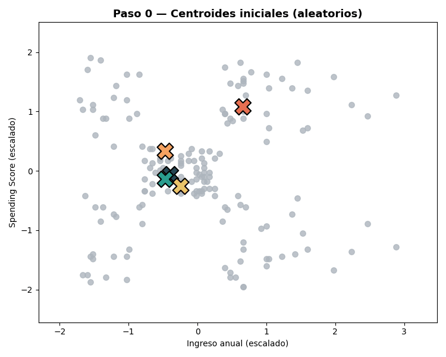
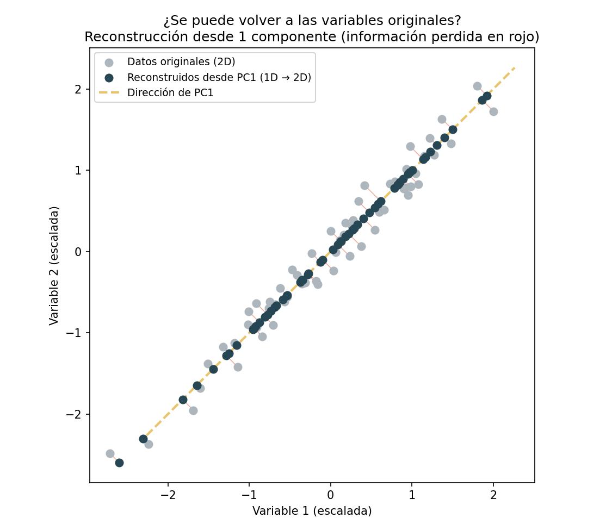

<!-- _class: lead -->
<!-- _paginate: false -->

# Clusterización
## Encontrar grupos donde nadie te dijo cuáles son

**Fin de semana 2 · Viernes · Clase teórica (~2 h)**

*Basado en An Introduction to Statistical Learning (ISL)*
Cap. 12 — Unsupervised Learning

---

# El caso de negocio

Una empresa quiere **entender los perfiles** de sus clientes para diseñar
campañas diferenciadas.

- Tenemos variables de comportamiento (ingreso, gasto, uso de productos)…
- …pero **no hay una etiqueta** que diga a qué grupo pertenece cada cliente.
- Nadie nos dio la respuesta correcta de antemano — tenemos que **descubrirla**.

> Objetivo: **descubrir estructura** en los datos sin una variable respuesta.
> Esto es **aprendizaje no supervisado**.

---

# Agenda

1. Recordatorio: supervisado vs. **no supervisado**
2. **K-Means** — la idea, el algoritmo, sus límites
3. **Clustering jerárquico** — dendrogramas, sin fijar K de antemano
4. **DBSCAN** — clustering por densidad, cuando la forma importa
5. **¿Cómo medir la calidad de un clustering?** — 4 métricas
6. La escala importa (otra vez)
7. Perfilamiento e interpretación de negocio
8. Comparando los 3 algoritmos entre sí
9. Trampas comunes
10. Demo en vivo

---

<!-- _class: lead -->
# Parte 1
## Recordatorio: supervisado vs. no supervisado

---

# En Clasificación, teníamos una respuesta correcta

En el Tema 1 (clasificación), cada fila tenía una etiqueta `Risk = good/bad`.

- Entrenábamos el modelo **contra esa etiqueta**.
- Medíamos qué tan bien acertaba con **accuracy, F1, matriz de confusión** —
  comparando predicción vs. **verdad conocida**.

> Todo el aprendizaje supervisado se reduce a: "aquí está la respuesta
> correcta, aprende a reproducirla".

---

# Hoy: no hay respuesta correcta

ISL §12.1 — solo observamos las features $X_1, \dots, X_p$; **no hay $Y$**.

- No buscamos predecir una etiqueta, sino **descubrir patrones o subgrupos**
  que ya existen en los datos, sin que nadie los haya anotado.
- Dos grandes familias en ISL:
  - **PCA** — reducción de dimensión (§12.2)
  - **Clustering** — encontrar grupos homogéneos (§12.4) ← el tema de hoy

> Es **más subjetivo** que clasificación: no hay una respuesta "correcta" ni
> un error que minimizar de forma tan clara.

---

# El reto de no tener etiqueta

Sin $Y$ verdadero:

- No podemos calcular *accuracy* ni un error de predicción.
- No hay validación cruzada directa contra "la verdad".
- La **evaluación es indirecta**: qué tan compactos y separados quedan los
  grupos, más **interpretabilidad de negocio**.

> El éxito se juzga por si los segmentos son **accionables**, no por una
> métrica única — vamos a ver 4 formas de medir "calidad", pero ninguna
> reemplaza mirar los resultados con ojo de negocio.

---

<!-- _class: lead -->
# Parte 2
## K-Means

---

# K-Means — la idea

ISL §12.4.1 — partir las observaciones en **K grupos** sin solapamiento, tan
**homogéneos internamente** como sea posible.

- Cada observación pertenece a **un solo** cluster.
- Cada cluster se representa por su **centroide** (el promedio de sus puntos).
- "Homogéneo" = los puntos de un mismo cluster están **cerca entre sí**.

Minimiza la **variación intra-cluster** total:

$$\min_{C_1,\dots,C_K} \sum_{k=1}^{K} W(C_k)$$

---

# K-Means — la función objetivo

La variación intra-cluster se mide como distancia euclídea al cuadrado:

$$W(C_k) = \frac{1}{|C_k|} \sum_{i, i' \in C_k} \sum_{j=1}^{p} (x_{ij} - x_{i'j})^2$$

- Suma, para cada par de puntos **dentro del mismo cluster**, qué tan lejos
  están en cada variable $j$.
- Cuanto más compacto el cluster, **menor** este valor.
- K-Means busca la partición que hace esta suma **lo más pequeña posible**.

---

# K-Means — el algoritmo

ISL §12.4.1 — iterativo, en dos pasos que se repiten:

1. Asignar aleatoriamente cada observación a uno de los K clusters.
2. **Repetir hasta converger:**
   a. Calcular el **centroide** de cada cluster (el promedio de sus puntos).
   b. Reasignar cada observación al centroide **más cercano**.

- Garantiza reducir el objetivo en **cada** paso — nunca empeora.
- Converge, pero a un **óptimo local** → depende de dónde arrancó.

---

# K-Means, paso a paso 🎬

*Centroides iniciales (aleatorios) → asignar cada punto al centroide más
cercano **por distancia euclidiana** → recalcular centroides como el
promedio de su cluster → repetir hasta que no se muevan. Mismos datos reales
de Mall Customers que usaremos en la demo.*

---

# K-Means — naturaleza local → múltiples inicios

- Distintos puntos de arranque → **distintas soluciones finales**.
- **Solución práctica:** correr el algoritmo varias veces (`n_init`) con
  arranques distintos, y quedarse con la corrida de **menor** variación
  intra-cluster.
- Fijar `random_state` para que el resultado sea **reproducible**.

> En la práctica: `KMeans(n_clusters=k, n_init=10, random_state=...)`.

---

# K-Means — ventajas y límites

**A favor:**
- Simple, rápido, escala bien a datasets grandes.
- Fácil de explicar a negocio (centroides = "cliente promedio del grupo").

**Límites:**
- Hay que **fijar K de antemano**.
- Asume clusters **esféricos y de tamaño similar** — le cuesta con formas
  irregulares (lo vamos a ver en vivo con DBSCAN).
- Sensible a **outliers** (un punto extremo puede arrastrar un centroide).

---

<!-- _class: lead -->
# Parte 3
## Clustering jerárquico

---

# Clustering jerárquico — la idea

ISL §12.4.2 — en vez de fijar K y particionar de una vez, **construye una
jerarquía completa** de agrupaciones, de abajo hacia arriba (*aglomerativo*):

1. Cada observación empieza como su **propio cluster** (N clusters).
2. En cada paso, se **fusionan los dos clusters más parecidos**.
3. Se repite hasta que **todo** queda en un solo cluster.

El resultado no es una partición fija, sino un **árbol de fusiones**: un
**dendrograma**.

---

# El dendrograma

- Cada fusión se dibuja como una **unión en forma de U**, a una altura que
  representa **qué tan distintos** eran los clusters que se fusionaron.
- Fusiones **bajas** = clusters muy parecidos. Fusiones **altas** = clusters
  muy distintos, unidos casi al final.
- Para obtener K grupos, se **"corta" el árbol** horizontalmente: cada rama
  que cruza la línea de corte es un cluster.

> Ventaja clave: **no hay que decidir K antes de correr el algoritmo** — se
> decide después, mirando el árbol completo.

---

# El dendrograma, en vivo (interactivo) 🖱️

<iframe src="interactive/dendrograma.html" width="100%" height="480" style="border:none;"></iframe>

*Dendrograma real sobre Mall Customers — pasa el mouse sobre las ramas.*

---

# ¿Qué tan "parecidos" son dos clusters? — Linkage

Para fusionar, hace falta definir la distancia **entre clusters** (no solo
entre puntos). El criterio se llama **linkage**:

| Linkage | Definición | Tendencia |
|---|---|---|
| **Complete** | distancia máxima entre cualquier par de puntos | clusters compactos, bien separados |
| **Average** | distancia promedio entre todos los pares | balance entre los dos extremos |
| **Ward** | fusión que **menos aumenta** la varianza intra-cluster | clusters de tamaño similar, muy usado por defecto |
| **Single** | distancia mínima entre cualquier par de puntos | clusters alargados, sensible a "cadenas" de ruido |

En `scikit-learn`: `AgglomerativeClustering(n_clusters=k, linkage="ward")`.

---

# Jerárquico vs. K-Means

| | K-Means | Jerárquico |
|---|---|---|
| ¿Hay que fijar K antes? | Sí | No (se corta el árbol después) |
| ¿Determinista? | No (depende del arranque, por eso `n_init`) | Sí (siempre da el mismo árbol) |
| Escala a datasets grandes | Bien | Cuesta más (complejidad ~$O(n^2)$ o peor) |
| Forma de los clusters | Esféricos | Depende del linkage, algo más flexible |
| Output | Una partición | Un árbol completo (varias particiones posibles) |

> En la práctica: jerárquico es ideal para **explorar** estructura a varias
> resoluciones en datasets medianos; K-Means gana cuando el dataset es grande.

---

<!-- _class: lead -->
# Parte 4
## DBSCAN

---

# El problema que K-Means y jerárquico no resuelven bien

Ambos algoritmos asumen clusters más o menos **convexos** (redondeados).

- ¿Qué pasa si los clusters tienen **forma de luna**, **anillos
  concéntricos**, o **densidad muy distinta**?
- ¿Qué pasa si hay **outliers** que no pertenecen a ningún grupo real, y
  forzarlos a un cluster distorsiona el resultado?

> K-Means y jerárquico **fuerzan** a cada punto a pertenecer a un cluster.
> DBSCAN no.

---

# DBSCAN — la idea

**D**ensity-**B**ased **S**patial **C**lustering of **A**pplications with
**N**oise. En vez de centroides o fusiones, agrupa por **densidad**: un
cluster es una región donde los puntos están **muy juntos entre sí**,
separada de otras regiones por zonas de **baja densidad**.

Dos parámetros:
- **`eps`** ($\varepsilon$): radio de vecindad alrededor de cada punto.
- **`min_samples`**: mínimo de puntos vecinos (dentro de `eps`) para
  considerar una zona "densa".

---

# DBSCAN — tipos de punto

Para cada punto, DBSCAN decide a cuál de estas 3 categorías pertenece:

- **Punto núcleo (*core*):** tiene al menos `min_samples` vecinos dentro de
  `eps`. Es el "centro" de una zona densa.
- **Punto frontera (*border*):** no es núcleo, pero es vecino de un punto
  núcleo. Se une a ese cluster.
- **Punto de ruido (*noise*):** no es núcleo ni frontera de ninguno →
  **no pertenece a ningún cluster**. Se marca con la etiqueta `-1`.

Un cluster es un conjunto de puntos núcleo conectados entre sí, más sus
puntos frontera.

---

# DBSCAN — por qué es distinto

**A favor:**
- **No hay que fijar K** — el número de clusters emerge solo.
- Encuentra clusters de **forma arbitraria** (no solo esféricos).
- **Detecta outliers explícitamente** (`-1`), en vez de forzarlos a un grupo.

**Límites:**
- Hay que elegir `eps`/`min_samples` — no siempre es intuitivo.
- Le cuesta con clusters de **densidad muy distinta entre sí** (un solo `eps`
  no sirve para todos).
- En dimensiones muy altas, "densidad" pierde significado (maldición de la
  dimensionalidad).

---

# Por qué DBSCAN gana aquí (interactivo) 🖱️

<iframe src="interactive/two_moons.html" width="100%" height="460" style="border:none;"></iframe>

*Dataset sintético "two moons": K-Means fuerza una línea recta entre dos
centroides y parte cada luna por la mitad. DBSCAN sigue la densidad y separa
las dos formas correctamente, sin que nadie le diga que son "lunas".*

---

# Los 3 algoritmos, en una frase

| Algoritmo | Idea central | Úsalo cuando… |
|---|---|---|
| **K-Means** | Minimizar distancia a K centroides | Dataset grande, clusters razonablemente redondeados, quieres velocidad |
| **Jerárquico** | Fusionar de abajo hacia arriba | Dataset mediano, no sabes K, quieres explorar varias resoluciones |
| **DBSCAN** | Agrupar por densidad, aislar ruido | Formas irregulares, esperas outliers reales en los datos |

> Ningún algoritmo es "el mejor" en abstracto — depende de la forma de tus
> datos. Por eso hoy vamos a **correr los 3** sobre el mismo problema.

---

# Los 3, sobre Mall Customers (interactivo) 🖱️

<iframe src="interactive/comparacion_clusters.html" width="100%" height="500" style="border:none;"></iframe>

*Usa los botones para alternar entre K-Means, Jerárquico y DBSCAN sobre el
mismo dataset — pasa el mouse por los puntos para ver el detalle.*

---

<!-- _class: lead -->
# Parte 5
## ¿Cómo medir la calidad de un clustering?

---

# El problema de fondo

Sin etiqueta verdadera, "calidad" solo puede significar una cosa:

> Los puntos de un mismo cluster deben estar **cerca entre sí**
> (cohesión), y los de clusters distintos deben estar **lejos**
> (separación).

Las 4 métricas de hoy miden distintas combinaciones de cohesión + separación,
calculadas **solo a partir de las features y las etiquetas asignadas** — por
eso se llaman **métricas internas**.

---

# Métrica 1 — Método del codo (inercia)

Específica de K-Means: la **inercia** es la suma de $W(C_k)$ de todos los
clusters — literalmente el objetivo que K-Means minimiza.

$$\text{inercia}(K) = \sum_{k=1}^{K} W(C_k)$$

- Con más clusters, la inercia **siempre baja** (en el extremo, K = N da
  inercia 0).
- Buscamos el **"codo"**: el K donde agregar un cluster más ya **no reduce
  mucho** la inercia.

*Solo aplica a algoritmos basados en centroides (K-Means).*

---

# Métrica 2 — Silhouette score

Aplica a **cualquier** algoritmo. Mide, para cada punto $i$, qué tan bien
encaja en su propio cluster frente al cluster vecino más cercano:

$$s(i) = \frac{b(i) - a(i)}{\max(a(i), b(i))}$$

- $a(i)$: distancia promedio de $i$ a los demás puntos de **su** cluster.
- $b(i)$: distancia promedio de $i$ al cluster **vecino** más cercano.
- $s \in [-1, 1]$: cerca de **1** = bien asignado; cerca de **0** = en el
  borde entre dos clusters; **negativo** = probablemente mal asignado.

El silhouette del clustering completo es el **promedio** de $s(i)$.

---

# Métrica 3 — Davies-Bouldin Index

Compara, para cada cluster, su **dispersión interna** contra qué tan lejos
está de su cluster más parecido:

$$DB = \frac{1}{K}\sum_{k=1}^{K} \max_{k' \ne k} \left(\frac{\sigma_k + \sigma_{k'}}{d(c_k, c_{k'})}\right)$$

- $\sigma_k$: dispersión promedio dentro del cluster $k$.
- $d(c_k, c_{k'})$: distancia entre los centroides $k$ y $k'$.

**Más bajo = mejor** (clusters compactos y bien separados). Es la única de
las 4 donde **menor es mejor** — hay que tener cuidado al leerla.

---

# Métrica 4 — Calinski-Harabasz Index

También llamado *Variance Ratio Criterion*: compara la dispersión **entre**
clusters contra la dispersión **dentro** de cada cluster.

$$CH = \frac{\text{dispersión entre clusters}}{\text{dispersión dentro de clusters}} \times \frac{N - K}{K - 1}$$

- Es esencialmente un ratio tipo ANOVA: ¿los clusters explican más varianza
  de la que dejan sin explicar?
- **Más alto = mejor** separación relativa a la compacidad.
- Rápida de calcular, buena para comparar muchos valores de K rápidamente.

---

# Las 4 métricas, en una tabla

| Métrica | ¿Mejor alto o bajo? | ¿Sirve para cualquier algoritmo? | Disponible en |
|---|---|---|---|
| Inercia (codo) | Más bajo, buscando el "codo" | Solo basados en centroides | `.inertia_` de `KMeans` |
| Silhouette | **Más alto** | Sí | `silhouette_score` |
| Davies-Bouldin | **Más bajo** | Sí | `davies_bouldin_score` |
| Calinski-Harabasz | **Más alto** | Sí | `calinski_harabasz_score` |

> Ninguna métrica sustituye la interpretación de negocio — se usan para
> **comparar opciones** (distintos K, distintos algoritmos), no como
> veredicto final.

---

# Eligiendo K, en vivo (interactivo) 🖱️

<iframe src="interactive/eleccion_k.html" width="100%" height="480" style="border:none;"></iframe>

*Codo y silhouette calculados sobre Mall Customers — pasa el mouse sobre cada
punto para ver el valor exacto en cada K.*

---

<!-- _class: lead -->
# Parte 6
## La escala importa (otra vez)

---

# Por qué escalar antes de clusterizar

Los 3 algoritmos de hoy usan **distancias** entre puntos → variables en
escalas grandes **dominan** el resultado.

- Un balance de miles de dólares pesaría muchísimo más que una frecuencia
  entre 0 y 1, aunque ambas sean igual de relevantes para el negocio.
- **Solución:** estandarizar (`StandardScaler`, media 0, desviación 1) antes
  de clusterizar — para los 3 algoritmos, no solo para K-Means.

> ISL insiste en esto (§12.4.2): la decisión de **escalar** cambia por
> completo los grupos resultantes.

---

<!-- _class: lead -->
# Parte 7
## Perfilamiento — dar sentido a los clusters

---

# Perfilamiento e interpretación de negocio

Encontrar los grupos es solo la mitad; hay que **interpretarlos**.

- Calcular la **media de cada variable por cluster**.
- Traducir a **etiquetas de negocio**: "premium de alto gasto",
  "potencial no explotado", "sensibles a promociones"…
- Definir una **acción distinta** por segmento.
- Si usaste DBSCAN: revisar aparte los puntos marcados como **ruido**
  (`-1`) — pueden ser clientes atípicos que merecen tratamiento individual,
  no un error a corregir.

> El valor está en la **interpretación accionable**, no en el algoritmo.

---

<!-- _class: lead -->
# Parte 8
## Comparando los 3 algoritmos

---

# Un flujo de comparación razonable

1. Escalar los datos.
2. Correr **K-Means** con el K elegido por codo + silhouette.
3. Correr **jerárquico** (ward) con el mismo K, cortando el dendrograma.
4. Correr **DBSCAN**, ajustando `eps`/`min_samples` hasta obtener un número
   de clusters razonable (no todo ruido, no todo un solo cluster).
5. Calcular **silhouette, Davies-Bouldin y Calinski-Harabasz** para los tres.
6. Comparar en una tabla — y mirar los scatter plots, no solo los números.
7. Elegir el que combine **mejores métricas** con **clusters interpretables**
   para el negocio.

---

<!-- _class: lead -->
# Trampas comunes ⚠️

---

# Trampas comunes ⚠️

- **No estandarizar** cuando las escalas difieren.
- Tomar el primer K sin evaluar codo/silhouette/Davies-Bouldin/Calinski-Harabasz.
- Un solo `n_init` en K-Means → caer en un óptimo local pobre.
- Usar K-Means en datos con forma claramente no convexa (ahí DBSCAN gana).
- Ignorar los puntos de ruido de DBSCAN en vez de investigarlos.
- Sobre-interpretar clusters que en realidad son ruido.
- **Confiar en un scatter 2D de PCA sin mirar cuánta varianza explica** —
  con muchas variables, 2 componentes pueden capturar menos de la mitad de
  la información. Repórtalo, y si es bajo, apóyate más en las métricas que
  en el gráfico.
- Olvidar que **no hay respuesta única**: la validación final es de negocio.

---

# Ahora: a la demo 🚀

En el notebook del viernes:

**Carga → Escalado → K-Means (codo + silhouette) → Jerárquico → DBSCAN →
Comparación con las 4 métricas → Visualización → Perfilamiento**

- **Hoy (demo):** Mall Customers — 200 clientes, 2 variables clave (2D), los
  3 algoritmos lado a lado.
- **Sábado (tú):** Credit Card — 8,950 clientes, 17 variables de
  comportamiento (usarás PCA para visualizar), comparando los 3 algoritmos.

---

<!-- _class: lead -->
# Anexo
## PCA en profundidad

*Lo que vas a usar el sábado para visualizar 17 variables en 2D — cómo
funciona, qué tan confiable es, y qué se pierde en el camino.*

---

# El problema: no podemos ver 17 dimensiones

El sábado, `CC_GENERAL` tiene **17 variables**. Un scatter plot solo tiene 2
ejes.

- No podemos graficar 17 dimensiones directamente.
- Pero sí podemos buscar **las 2 direcciones que más información conservan**
  del dataset original, y graficar **eso**.

> Esa es la idea de **PCA** (Análisis de Componentes Principales): no es
> magia, es una forma sistemática de **resumir** muchas variables en pocas,
> perdiendo la menor cantidad de información posible.

---

# La lógica de PCA, con una analogía

Imagina que fotografías una nube de puntos en 3D **desde distintos ángulos**.

- Desde algunos ángulos, la nube se ve como una línea delgada (mala foto,
  poca información).
- Desde otro ángulo, la nube se ve **extendida y con forma** (buena foto,
  se nota la estructura).

**PCA encuentra automáticamente el mejor ángulo**: la dirección desde la cual
los datos se ven **más dispersos** (mayor varianza) — porque esa dispersión
*es* la información que queremos conservar.

---

# PCA, con datos reales (interactivo) 🖱️

<iframe src="interactive/pca_direcciones.html" width="100%" height="480" style="border:none;"></iframe>

*`PURCHASES` vs. `ONEOFF_PURCHASES` (correlación ≈ 0.91). PC1 es la
dirección de máxima varianza; PC2 es perpendicular a PC1 y captura lo que
sobra.*

---

# ¿Cómo se calculan los componentes?

Cada componente principal es una **combinación lineal** de las variables
originales:

$$PC_1 = w_{11} X_1 + w_{12} X_2 + \dots + w_{1p} X_p$$

- Los pesos $w_{1j}$ (llamados **loadings**) se eligen para que $PC_1$ tenga
  la **varianza máxima posible**, sujeto a que el vector de pesos tenga
  longitud 1.
- $PC_2$ se calcula igual, pero con la restricción extra de ser
  **perpendicular (ortogonal)** a $PC_1$ — así no repite información.
- Matemáticamente: los $w$ son los **autovectores** de la matriz de
  covarianza, ordenados por su **autovalor** (la varianza que capturan).

> Por eso hay que **escalar antes de PCA**, igual que con clustering: si una
> variable tiene una escala mucho más grande, va a dominar la varianza y
> "ganar" el primer componente solo por eso.

---

# ¿Cuántos componentes uso? — Scree plot

Cada componente adicional explica **cada vez menos** varianza nueva (por
construcción). Un **scree plot** muestra la varianza explicada por
componente y la acumulada, para decidir cuántos conservar.

<iframe src="interactive/pca_scree.html" width="100%" height="460" style="border:none;"></iframe>

---

# El costo de reducir a 2D, con datos reales

En `CC_GENERAL`, los primeros **2** componentes (de 17 posibles) explican
solo **~47-48% de la varianza total**.

- No es un error ni un mal ajuste — es lo esperable con 17 variables de
  comportamiento poco redundantes entre sí.
- **Consecuencia práctica:** el scatter 2D que vas a graficar el sábado es
  una simplificación real. Dos clientes que se ven cerca en el gráfico
  podrían estar más lejos en las otras 15 dimensiones no mostradas.
- Por eso las **métricas de calidad** (silhouette, Davies-Bouldin,
  Calinski-Harabasz) — calculadas sobre las 17 variables, no sobre la
  proyección — siguen siendo el criterio más confiable.

---

# Interpretar los componentes — el biplot

Un **biplot** combina dos cosas en un mismo gráfico:
- Los **puntos** proyectados en PC1/PC2 (como el scatter que ya conoces).
- **Flechas** que muestran, para cada variable original, hacia dónde
  "empuja" cada componente y con qué fuerza (el **loading**).

Una flecha larga y alineada con el eje de PC1 → esa variable define en buena
parte qué es PC1. Flechas que apuntan en direcciones parecidas → esas
variables están correlacionadas entre sí.

---

# Biplot, con datos reales (interactivo) 🖱️

<iframe src="interactive/pca_biplot.html" width="100%" height="500" style="border:none;"></iframe>

*Las flechas rojas son las variables originales (las 10 con mayor peso están
etiquetadas). Variables con flechas parecidas se mueven juntas.*

---

# ¿Se puede volver a las variables originales?

Sí, con `pca.inverse_transform()` — pero **con pérdida**, salvo que uses
**todos** los componentes.

- Si te quedas con todos los componentes (17 de 17), la reconstrucción es
  **exacta**: no perdiste nada, solo rotaste el sistema de coordenadas.
- Si te quedas con **menos** (p. ej. 2 de 17), la reconstrucción es una
  **aproximación**: PCA "rellena" lo que no conservó con el mejor valor
  promedio posible, pero no es el dato real.

> Por eso PCA se usa para **visualizar y resumir**, no para "inventar" datos
> que no se midieron.

---

# La reconstrucción, ilustrada

*Ejemplo simplificado en 2D→1D: los puntos oscuros son la reconstrucción
usando solo PC1. Las líneas rojas son la información que se perdió al
descartar PC2 — el "costo" de reducir dimensiones.*

---

# PCA — trampas comunes ⚠️

- Aplicar PCA **sin escalar** antes (una variable con escala grande domina
  todos los componentes).
- Tratar los componentes como si tuvieran un significado de negocio directo
  — hay que **mirar los loadings** para interpretarlos, no asumir.
- Usar un scatter 2D de PCA como prueba definitiva de que "no hay
  estructura" — puede que la estructura esté en las dimensiones que no se
  graficaron.
- Olvidar reportar **qué % de varianza** capturan los componentes que estás
  usando — sin ese número, el gráfico no dice qué tan confiable es.

---

<!-- _class: lead -->

# ¿Preguntas?

**Lecturas ISL recomendadas:**
cap. 12 — Unsupervised Learning (§12.1 introducción,
§12.4.1 K-means, §12.4.2 clustering jerárquico y escalado).
