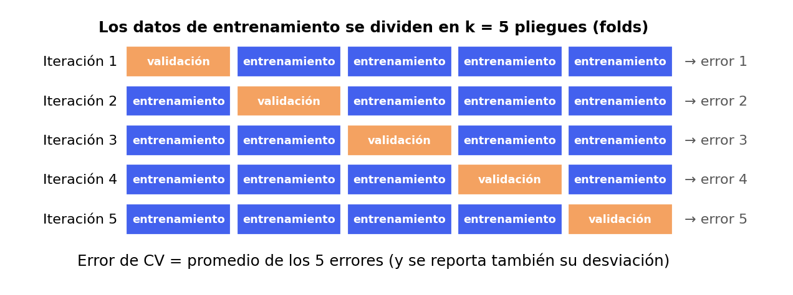
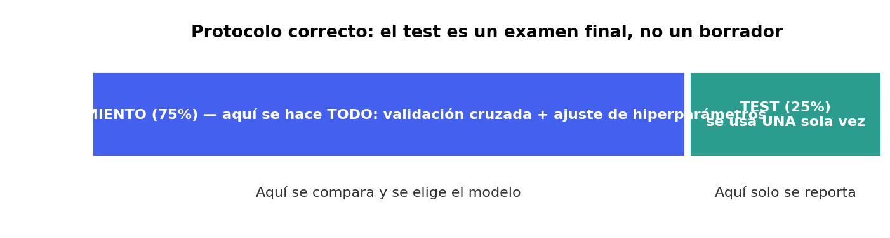

<!-- _class: lead -->
<!-- _paginate: false -->

# Regresión
## Una investigación: ¿qué modelo predice mejor la liquidez?

**Fin de semana 3 · Viernes · Clase teórica (~2.5 h)**

*Basado en An Introduction to Statistical Learning (ISL)*
Cap. 3 — Linear Regression · Cap. 6 — Regularization · Cap. 8 — Tree-Based Methods

---

# Repaso 1/3 — Clasificación (FDS 1)

**Pregunta:** ¿a qué **categoría** pertenece cada caso? ($Y$ categórica)
*Caso:* score de riesgo crediticio (German Credit → Credit Score).

- **Ideas base del curso:** aprendizaje supervisado, **train/test**,
  **sobreajuste** y el balance **sesgo–varianza**.
- **Modelos:** regresión logística, árbol de decisión, Random Forest.
- **Métricas:** matriz de confusión, precision / recall / F1, **ROC-AUC**.
- **Lección:** el *accuracy* engaña con clases desbalanceadas; en banca,
  **interpretar** el modelo importa tanto como acertar.

---

# Repaso 2/3 — Clusterización (FDS 2)

**Pregunta:** ¿qué **grupos** naturales hay? (**sin** respuesta correcta: aprendizaje
*no supervisado*). *Caso:* segmentación de clientes (Mall Customers → Credit Card).

- **Algoritmos:** **K-Means**, clustering **jerárquico** (dendrograma) y **DBSCAN**
  (formas arbitrarias + detección de ruido).
- **¿Cuántos grupos?** Codo, **silhouette**, Davies-Bouldin, Calinski-Harabasz.
- **Imprescindible:** **escalar** antes de medir distancias; **PCA** para
  visualizar en 2D; **perfilar** cada cluster en lenguaje de negocio.
- **Lección:** sin etiqueta no hay "accuracy" — se valida con métricas **y**
  con sentido de negocio.

---

# Repaso 3/3 — Regresión (FDS 3, hoy)

**Pregunta:** ¿**cuánto** vale? ($Y$ continua). *Caso:* liquidez (Current Ratio).

- **Camino de hoy:** modelo lineal → **diagnóstico** (residuos, VIF, sesgo vs.
  varianza) → **Ridge/Lasso** → **Árbol, Random Forest, XGBoost**.
- **Métricas e interpretación:** MAE, RMSE, $R^2$, MAPE; coeficientes vs.
  importancia de variables, **PDP**.
- **Lección:** lo lineal **no siempre alcanza**; compara familias de modelos
  y vigila la **fuga de información**.

> **Hilo común:** datos → EDA → dividir → modelar → **evaluar bien** →
> interpretar. Hoy sumamos **validación cruzada** e **hiperparámetros** (Acto 7).

---

# El caso de negocio

Un analista financiero quiere **estimar la liquidez** de una empresa
(el **Current Ratio**) a partir de otros indicadores.

- La variable respuesta $Y$ es **continua** → problema de **regresión**.
- Predictores $X$: rentabilidad, márgenes, endeudamiento, flujos de caja.

> Objetivo doble: **predecir** la liquidez y **entender qué indicadores** la
> explican (inferencia).

---

# Clasificación vs. regresión — el mismo problema, distinto tipo de $Y$

En el Tema 1 predecíamos una **categoría** (`good`/`bad`, `Poor`/`Standard`/`Good`).
Hoy predecimos un **número continuo** (el Current Ratio puede ser 0.88, 1.35,
2.4…).

- El *aprendizaje supervisado* es el mismo marco: hay un target $Y$ conocido
  en el train, y aprendemos una función $f$ que lo aproxima a partir de $X$.
- Lo que cambia es **cómo medimos el error** y, como consecuencia, **qué
  algoritmos y métricas aplican**.
- La buena noticia: **casi todos los algoritmos de clasificación que ya
  viste tienen una versión de regresión** — árboles, Random Forest,
  gradient boosting — cambia la función de pérdida, no la idea del algoritmo.

---

# La clase de hoy es una investigación, no un catálogo

En vez de una lista de "aquí hay 6 algoritmos", vamos a **construir un
modelo en vivo**, con datos reales de 137 empresas, y dejar que los
resultados guíen las decisiones — exactamente como pasa en un proyecto real:

1. Probamos lo obvio (regresión lineal).
2. Diagnosticamos por qué funciona peor de lo esperado.
3. Intentamos arreglarlo dentro de la familia lineal (regularización).
4. Vemos que **no alcanza**, y descubrimos por qué.
5. Cambiamos de familia de modelo (árboles) — y el resultado da un salto.
6. Pagamos el costo de ese salto: perdemos interpretabilidad directa, y
   aprendemos a recuperarla.

Todos los números que van a aparecer hoy son **reales**, del mismo dataset
que van a ver ejecutado en la demo.

---

<!-- _class: lead -->
# Acto 1
## Antes de 12 variables, un ejemplo con 1

---

# Empecemos simple: ROA vs. Current Ratio

Antes de meter las 12 variables del modelo completo, miremos **una sola**
relación real: rentabilidad sobre activos (ROA) vs. liquidez.

**Pregunta:** ¿una línea recta describe bien esta relación?

---

# ¿Una línea recta alcanza?


*Datos reales (137 empresas). La línea roja es el mejor ajuste lineal
posible. La línea oscura es la tendencia real suavizada: sube, llega a un
máximo alrededor de ROA≈12, y luego **baja**. Una línea recta no puede
hacer eso — por diseño, solo sabe subir o bajar, nunca las dos cosas.*

---

# Guardemos esta pista

- Con **una sola variable**, ya vemos que la relación real **no es
  lineal** — tiene forma de joroba, no de línea.
- Con **12 variables** relacionándose entre sí de formas parecidas, es
  razonable sospechar que el problema se mantiene o empeora.
- Vamos a construir el modelo lineal completo de todas formas — es el punto
  de partida estándar, y **necesitamos verlo fallar con números reales**
  para entender exactamente qué falla y por qué.

---

# Agenda de hoy

**Acto 2 — El modelo lineal completo**: ajuste, métricas, primer resultado real.
**Acto 3 — El diagnóstico**: supuestos, residuos, VIF, y el marco de
sesgo vs. varianza.
**Acto 4 — El intento de arreglo**: regularización (Ridge/Lasso) — ¿ayuda?
**Acto 5 — El giro**: árboles, Random Forest, XGBoost.
**Acto 6 — El costo del giro**: coeficientes vs. importancia de variables,
y cómo recuperar interpretabilidad con un *Partial Dependence Plot*.
**Acto 7 — Evaluar y afinar con rigor**: validación cruzada e
hiperparámetros (ISL cap. 5 y §6.2).
**Cierre — Hacia dónde vamos**: lo que no cubrimos (ensambles avanzados,
deep learning, RL) y cómo llevar modelos a producción (MLflow).

---

<!-- _class: lead -->
# Acto 2
## El modelo lineal completo

---

# 1. El modelo lineal

ISL §3.1 — asumimos una relación aproximadamente lineal:

$$Y = \beta_0 + \beta_1 X_1 + \beta_2 X_2 + \dots + \beta_p X_p + \varepsilon$$

- $\beta_j$: efecto **promedio** sobre $Y$ de subir $X_j$ una unidad,
  **manteniendo lo demás constante**.
- $\varepsilon$: error irreducible.

> Simple, interpretable y sorprendentemente competitivo en muchos problemas
> — el punto de partida de ISL. Hoy vamos a ver un caso donde **no** lo es.

---

# 2. Mínimos cuadrados (OLS)

ISL §3.1.1 — elegimos los coeficientes que **minimizan la suma de residuos al
cuadrado**:

$$\text{RSS} = \sum_{i=1}^{n} \left(y_i - \hat{y}_i\right)^2$$

- $\hat{y}_i = \hat{\beta}_0 + \hat{\beta}_1 x_{i1} + \dots$
- Solución cerrada; cada $\hat{\beta}_j$ tiene un **error estándar** para
  contrastes de hipótesis ($H_0: \beta_j = 0$).

---

# 3. ¿Qué tan bueno es el ajuste?

ISL §3.1.3 — dos medidas clave:

- **RSE** (Residual Standard Error): magnitud típica del error, en unidades de
  $Y$.
- **$R^2$**: proporción de la varianza de $Y$ explicada por el modelo,
  $R^2 \in [0, 1]$.

$$R^2 = 1 - \frac{\text{RSS}}{\text{TSS}}$$

También usaremos **MAE**, **RMSE** y **MAPE** para evaluar en el conjunto de
prueba — y para comparar de forma justa contra los modelos no lineales.

---

# Las métricas de regresión, en una tabla

| Métrica | Qué mide | Ventaja | Cuidado con |
|---|---|---|---|
| **MAE** | Error absoluto promedio | Fácil de interpretar, robusta a outliers | Pesa todos los errores igual |
| **RMSE** | Raíz del error cuadrático promedio | Penaliza más los errores **grandes** | Sensible a outliers |
| **R²** | % de varianza explicada | Comparable entre problemas, intuitivo | No dice nada sobre la magnitud del error |
| **MAPE** | Error porcentual promedio | Interpretable en % — ideal para negocio | Explota si $Y$ tiene valores cerca de 0 |

> RMSE y MAE casi siempre se reportan juntas (si RMSE ≫ MAE, hay errores
> grandes puntuales). MAPE es la más fácil de explicarle a negocio — y
> aquí es segura porque el Current Ratio nunca es cercano a 0.

---

# Intento 1: el modelo lineal completo

Ajustamos con las **12 variables** financieras (Revenue, EBITDA, ROA, ROE,
Debt/Equity, etc.) sobre 137 empresas (102 en train, 35 en test).

| | R² en train | R² en test |
|---|---|---|
| **Lineal** | **0.43** | **0.05** |

- En **train**, el modelo explica un 43% de la varianza — no es
  espectacular, pero es razonable.
- En **test**, cae a **5%** — prácticamente no generaliza. Es casi lo mismo
  que predecir siempre el promedio.

> Hay una brecha enorme entre train y test (0.43 → 0.05). Eso **no es
> normal**, y es la primera pista real que vamos a investigar.

---

<!-- _class: lead -->
# Acto 3
## El diagnóstico

---

# 4. Los supuestos del modelo lineal

ISL §3.3.3 — para que la inferencia sea válida:

1. **Linealidad** de la relación.
2. **Homocedasticidad:** varianza constante del error.
3. **Normalidad** aproximada de los residuos.
4. **Independencia** de los errores.
5. Ausencia de **multicolinealidad** severa.

> Violarlos no impide predecir, pero **invalida la interpretación** de los
> coeficientes — y, como vamos a ver, puede estar detrás de la brecha
> train/test que acabamos de encontrar.

---

# 4. Diagnóstico de residuos

ISL §3.3.3 — se revisa gráficamente:

- **Residuos vs. predichos:** deben ser una nube sin patrón alrededor de 0
  (patrón → no linealidad o heterocedasticidad).
- **QQ-plot:** los puntos sobre la diagonal → residuos ~ normales.

> El diagnóstico es tan importante como el $R^2$: un $R^2$ alto con residuos
> con patrón es sospechoso — y un $R^2$ bajo con residuos con patrón
> confirma que algo estructural está mal, no solo ruido.

---

# 5. Multicolinealidad — sospechoso #1

ISL §3.3.3 — cuando dos o más predictores están muy correlacionados entre sí.

- Infla la **varianza** de los $\hat{\beta}_j$ → coeficientes **inestables**:
  cambian mucho si cambian ligeramente los datos de entrenamiento.
- Un modelo con coeficientes inestables **ajusta bien el train** (encuentra
  *algún* balance de coeficientes que funciona ahí) pero **generaliza mal**
  — exactamente el patrón que acabamos de ver.
- Frecuente con **ratios financieros** (se mueven juntos: más ingresos,
  más utilidad, más EBITDA…).

Se mide con el **VIF (Variance Inflation Factor):**

$$\text{VIF}(\hat{\beta}_j) = \frac{1}{1 - R^2_{X_j \mid X_{-j}}}$$

> Regla práctica: **VIF > 5–10** indica un problema.

---

# El VIF, con datos reales

| Variable | VIF |
|---|---|
| EBITDA | **30.1** |
| Net Income | **24.2** |
| Gross Profit | **20.6** |
| Revenue | **15.3** |
| Net Profit Margin | 5.0 |
| Cash Flow from Operating | 4.5 |
| ROA | 4.1 |
| Number of Employees | 4.1 |
| Share Holder Equity | 3.6 |
| Debt/Equity Ratio | 2.5 |
| ROE | 1.8 |
| ROI | 1.1 |

**Confirmado:** 4 variables con VIF muy por encima de 10. `EBITDA`, `Net
Income`, `Gross Profit` y `Revenue` son, en el fondo, **la misma señal**
(tamaño/rentabilidad de la empresa) medida 4 veces.

---

# 5. ⚠️ Fuga de información (un peligro relacionado, pero distinto)

Incluir como predictor una variable que es **una reformulación del target**.

- Ej.: predecir *Current Ratio* usando *Quick Ratio* o
  *Cash/Current Liability*.
- El $R^2$ se dispara artificialmente hacia 1… pero el modelo **no aprende
  nada útil**: solo ve una copia de $Y$.

> No es nuestro problema hoy (ya lo evitamos), pero **sí** es el punto
> clave del ejercicio del sábado con el dataset de Taiwan.

---

# Dos sospechosos: sesgo y varianza

Toda la brecha train/test que estamos investigando se explica con **uno de
dos problemas** (o ambos):

- **Alto sesgo (underfitting):** el modelo es **demasiado simple** para la
  relación real — ni siquiera en train le va bien.
- **Alta varianza (overfitting):** el modelo es **demasiado sensible** a los
  datos de entrenamiento específicos — le va muy bien en train, pero no
  generaliza porque memorizó ruido en vez de señal.

---

# El diagnóstico, ilustrado


*A la izquierda, el modelo es tan simple que ni el train le sale bien (alto
sesgo). A la derecha, el modelo es tan flexible que memoriza el train pero
falla en test (alta varianza). El punto óptimo minimiza el error en test,
no en train.*

---

# ¿Qué dice nuestro caso?

| | R² train | R² test | Brecha |
|---|---|---|---|
| **Lineal** | 0.43 | 0.05 | **0.37** |

- Train **no** es bajo (0.43) → **no** parece un problema de sesgo puro.
- La brecha es enorme (0.37) → **sí** parece alta varianza.
- Y ya tenemos al sospechoso: **multicolinealidad severa** (VIF hasta 30)
  infla la varianza de los coeficientes en una muestra de solo 102 filas.

> **Hipótesis de trabajo:** si el problema es varianza por
> multicolinealidad, la **regularización** (que existe exactamente para
> esto) debería ayudar bastante. Vamos a probarlo.

---

<!-- _class: lead -->
# Acto 4
## El intento de arreglo: regularización

---

# 6. Regularización — ¿por qué?

ISL §6.2 — con muchos predictores correlacionados, OLS produce coeficientes
de **alta varianza**.

Idea: penalizar el tamaño de los coeficientes para **reducir varianza** a
cambio de un poco de sesgo (trade-off sesgo–varianza).

- Encoge los $\hat{\beta}_j$ hacia 0.
- Coeficientes más chicos y estables → menos sensibles al ruido del train
  → mejor generalización esperada.

---

# 6. Ridge vs. Lasso

ISL §6.2 — dos penalizaciones distintas:

**Ridge** (penalización $\ell_2$):
$$\min \; \text{RSS} + \lambda \sum_{j=1}^{p} \beta_j^2$$

**Lasso** (penalización $\ell_1$):
$$\min \; \text{RSS} + \lambda \sum_{j=1}^{p} |\beta_j|$$

- Ridge encoge pero **mantiene** todas las variables.
- Lasso puede llevar coeficientes a **exactamente 0** → **selección de
  variables**.

---

# 6. Elegir $\lambda$

ISL §6.2 — el hiperparámetro $\lambda$ controla la fuerza de la penalización:

- $\lambda = 0$ → OLS (sin regularizar).
- $\lambda \to \infty$ → todos los coeficientes hacia 0.
- Se elige por **validación cruzada** (la explicamos a fondo en el Acto 7).

> Importante: **escalar** los predictores antes de Ridge/Lasso — la
> penalización depende de la escala.

---

# Resultado real — ¿ayudó?

| | R² train | R² test | Brecha |
|---|---|---|---|
| Lineal | 0.43 | 0.05 | 0.37 |
| Ridge | 0.42 | **0.06** | 0.36 |
| Lasso | 0.42 | **0.07** | 0.35 |

- La brecha se redujo… **casi nada**. R² en test pasó de 0.05 a 0.07.
- La regularización sí hizo lo que promete (coeficientes más chicos, un
  poco más estables) — pero el techo del modelo **casi no se movió**.

> **La hipótesis de "solo es varianza" era incompleta.** Regularizar reduce
> varianza, pero no puede arreglar un problema de **forma equivocada** —
> y recordemos el Acto 1: la relación real (ROA) tenía forma de joroba, no
> de línea. Eso es **sesgo estructural**, y ningún $\lambda$ lo arregla.

---

<!-- _class: lead -->
# Acto 5
## El giro: modelos no lineales

---

# Cuando lo lineal no alcanza

La regresión lineal asume que el efecto de cada $X_j$ sobre $Y$ es
**constante** (no cambia según el valor de otras variables) y **aditivo**
(los efectos se suman). Vimos en el Acto 1 que, al menos para ROA, **eso ya
es falso** con una sola variable.

Necesitamos una familia de modelos que **no** asuma eso.

---

# 7. Árbol de decisión para regresión

ISL §8.1 — en vez de una ecuación, un árbol **parte el espacio de
predictores en regiones** y predice el **promedio de $Y$** dentro de cada
región.

- Cada split busca la pregunta (`¿ROA > 5?`) que **más reduce el error**
  (RSS) dentro de los dos grupos resultantes.
- Se repite recursivamente, creando regiones cada vez más pequeñas y
  homogéneas.
- Captura no linealidades e interacciones **automáticamente** — sin que
  nosotros tengamos que especificar la forma de la curva.

$$\hat{y} = \text{promedio de } y_i \text{ en la región que contiene a } x$$

---

# Un árbol individual, con datos reales


*El árbol sigue la forma general de la tendencia (a diferencia de la línea
recta) — pero también **memoriza un solo punto atípico** a la derecha,
creando un salto que no representa un patrón real. Esto es varianza,
otra vez, con otro algoritmo.*

---

# Resultado real — un árbol

| | R² train | R² test | Brecha |
|---|---|---|---|
| Lineal | 0.43 | 0.05 | 0.37 |
| Ridge / Lasso | 0.42 | 0.06–0.07 | ~0.35 |
| **Árbol** | **0.89** | **0.46** | **0.43** |

- El test **mejora muchísimo** (0.07 → 0.46): capturar la no linealidad
  vale la pena — confirma que el sesgo estructural era el problema
  dominante.
- Pero la brecha train/test **sigue siendo grande** (0.43): un solo árbol
  tiene **alta varianza** — es sensible a los datos específicos de train
  (como vimos con el punto atípico de la imagen).

> Arreglamos el sesgo, pero heredamos un problema de varianza nuevo.

---

# 8. Random Forest — arreglando la varianza, otra vez

ISL §8.2 — la solución al sobreajuste de un solo árbol: **promediar muchos
árboles distintos**.

- Cada árbol se entrena sobre una **submuestra aleatoria** de filas
  (*bagging*) y considera solo un **subconjunto aleatorio de variables** en
  cada split.
- La predicción final es el **promedio** de todos los árboles.
- Un árbol individual memoriza *su* punto atípico; promediar cientos de
  árboles (cada uno con una muestra distinta) **cancela ese ruido**.

> Misma lógica de sesgo-varianza del Acto 3, aplicada con árboles en vez de
> con $\lambda$: reducimos varianza promediando, no penalizando.

---

# Resultado real — Random Forest

| | R² train | R² test | Brecha |
|---|---|---|---|
| Árbol | 0.89 | 0.46 | 0.43 |
| **Random Forest** | **0.94** | **0.72** | **0.22** |

La brecha se **reduce a la mitad** y el test **casi se duplica**. Promediar
árboles funcionó exactamente como predice la teoría.

---

# 9. Gradient Boosting — la idea

ISL §8.2 — en vez de promediar árboles **independientes** (Random Forest),
*boosting* los entrena **secuencialmente**: cada árbol nuevo corrige los
**errores del conjunto anterior**.

1. Empieza con una predicción simple (el promedio de $Y$).
2. Calcula los **residuos** (dónde se equivoca el modelo actual).
3. Entrena un árbol **pequeño** para predecir esos residuos.
4. Suma esa predicción (escalada por una tasa de aprendizaje) al modelo.
5. Repite muchas veces.

> Cada árbol es débil por sí solo, pero la **suma secuencial** de árboles
> que corrigen errores previos produce un modelo muy potente.

---

# 9. XGBoost

**XGBoost** (*eXtreme Gradient Boosting*) es la implementación de gradient
boosting más usada en la práctica para datos tabulares.

- Mismo principio que el boosting genérico, con **regularización
  incorporada** (evita que los árboles individuales crezcan demasiado).
- Hiperparámetros clave: `n_estimators`, `learning_rate`, `max_depth`.
- `learning_rate` bajo + más árboles suele generalizar mejor que
  `learning_rate` alto + pocos árboles — el trade-off sesgo-varianza, otra vez.

> `HistGradientBoostingRegressor` (ya en scikit-learn) es una alternativa
> sin instalar nada adicional, con una idea muy similar.

---

# El resultado completo — las 6 filas

| Modelo | R² train | R² test | Brecha |
|---|---|---|---|
| Lineal | 0.43 | 0.05 | 0.37 |
| Ridge | 0.42 | 0.06 | 0.36 |
| Lasso | 0.42 | 0.07 | 0.35 |
| Árbol | 0.89 | 0.46 | 0.43 |
| Random Forest | 0.94 | 0.72 | 0.22 |
| **XGBoost** | **1.00** | **0.76** | 0.24 |

**XGBoost gana**, con el mejor test (0.76) — a pesar de tener el ajuste a
train casi perfecto (1.00). La brecha por sí sola no es lo que importa: lo
que importa es **cuánto generaliza**, y XGBoost generaliza mejor que todo
lo demás a pesar de memorizar el train casi a la perfección.

---

# Lineal vs. árboles — la tabla que resume todo

| | Modelos lineales (Lineal/Ridge/Lasso) | Árboles (RF/XGBoost) |
|---|---|---|
| Captura no linealidad | No (por diseño) | Sí, automáticamente |
| Necesita escalar | Sí (Ridge/Lasso) | No |
| Sufre por multicolinealidad | Sí (VIF, coeficientes inestables) | Mucho menos |
| Interpretación | Coeficiente = efecto directo | Importancia = "cuánto usa" la variable, no dirección |
| Con pocos datos | Un solo árbol sobreajusta mucho | Ensambles (RF/XGBoost) compensan promediando |
| Con muchos datos | No mejora tanto | Suele **ganar por mucho** |

---

<!-- _class: lead -->
# Acto 6
## El costo del giro: interpretabilidad

---

# 10. Interpretar: coeficientes vs. importancia de variables

- **Coeficiente lineal**: dirección (signo) y magnitud del efecto,
  manteniendo lo demás constante. Directamente interpretable — *si* el
  modelo es confiable (residuos ok, VIF bajo). El nuestro no cumplía eso.
- **Importancia de variables** (árboles): cuánto **reduce el error** una
  variable al usarse en los splits, sumado sobre todos los árboles. No dice
  la dirección del efecto, solo cuánto "pesa".

> Cuando una variable es importante en **ambas** familias, es una señal
> robusta. Cuando solo aparece en los árboles, sospecha de una relación no
> lineal o una interacción que el modelo lineal no puede ver.

---

# El caso de `Number of Employees`

En XGBoost, `Number of Employees` es la variable **más importante** — pero
en el modelo lineal tenía un coeficiente chico y una correlación simple de
apenas -0.19. ¿Contradicción, o exactamente lo que esperaríamos después de
todo lo que vimos hoy?

**Herramienta para responder esto: el *Partial Dependence Plot* (PDP)** —
grafica cómo cambia la predicción del modelo al mover **una variable**,
promediando sobre todas las demás. Es el equivalente, para un modelo de
árboles, de "leer un coeficiente".

---

# El PDP, con el modelo real de hoy


*Exactamente el patrón que sospechábamos: un **efecto umbral**. Para
empresas muy pequeñas, XGBoost predice liquidez alta; ese efecto cae
fuerte y se estabiliza una vez la empresa supera cierto tamaño. Una línea
recta no puede representar esta forma — por eso el coeficiente lineal de
esta variable era casi irrelevante, mientras que para XGBoost es la más
importante de todas.*

---

# Cerrando el círculo

- **Acto 1** mostró, con una variable, que la relación no era lineal.
- **Acto 6** lo confirma, con la variable más importante del mejor modelo:
  otra vez, un efecto no lineal (esta vez un umbral, no una joroba) que el
  modelo lineal no podía ver.
- La historia completa: el modelo lineal fallaba por **dos razones a la
  vez** — varianza por multicolinealidad (parcialmente arreglable con
  regularización) y **sesgo estructural** por forma incorrecta (solo
  arreglable cambiando de familia de modelo).

---

<!-- _class: lead -->
# Acto 7
## Evaluar y afinar con rigor: validación cruzada e hiperparámetros

---

# El problema de un solo split train/test

Hasta ahora evaluamos con **un único** corte: 75% train / 25% test.

- Con 137 empresas, el test tiene **~35 filas**: el resultado depende de
  **qué filas cayeron ahí**. Otra semilla → otro $R^2$.
- ¿La diferencia entre dos modelos es **real** o es **suerte del corte**?
- Además, si usamos el test para **decidir** (qué $\lambda$, qué modelo), el
  test deja de ser independiente.

> Necesitamos una forma de **estimar el error con menos azar** sin gastar el
> test. Esa herramienta es la **validación cruzada** (ISL §5.1).

---

# Validación cruzada de k pliegues (k-fold CV)



$$CV_{(k)} = \frac{1}{k}\sum_{i=1}^{k} \text{Error}_i$$

1. Parte el **train** en $k$ pliegues del mismo tamaño.
2. Entrena con $k-1$ y valida en el pliegue restante; repite $k$ veces.
3. Promedia los $k$ errores. **Todas** las filas se usan para validar una vez.

---

# Validación cruzada — cómo se usa bien

- **¿Qué $k$?** Lo habitual es **5 o 10** (ISL §5.1.4): buen equilibrio entre
  sesgo y varianza de la estimación y costo de cómputo. *LOOCV* ($k=n$) es
  carísimo y no suele mejorar.
- **Reporta media ± desviación.** Un modelo con RMSE medio bajo pero
  desviación alta es **inestable**.
- **Compara modelos con los mismos pliegues** (`KFold(..., random_state=semilla)`).
- **Clasificación:** usa pliegues **estratificados** (misma proporción de clases).
- **Datos en el tiempo** (estados financieros por año): no mezcles el futuro
  con el pasado → `TimeSeriesSplit`.

---

# Validación cruzada en código

```python
kf = KFold(n_splits=5, shuffle=True, random_state=cedula)
s = -cross_val_score(pipe, X_train, y_train, cv=kf,
                     scoring="neg_root_mean_squared_error")
print(f"RMSE = {s.mean():.3f} ± {s.std():.3f}")
```

⚠️ **El preprocesamiento va DENTRO del `Pipeline`.** Si escalas o winsorizas
*antes* de dividir, la información del pliegue de validación se **filtra** al
entrenamiento y el error de CV sale demasiado optimista. Con un `Pipeline`,
`cross_val_score` reajusta el escalado **en cada pliegue**.

> Resultado típico: `RMSE = 0.0015 ± 0.0003` → el ± te dice **cuánto confiar**
> en la diferencia entre dos modelos.

---

# Parámetros vs. hiperparámetros

| | **Parámetros** | **Hiperparámetros** |
|---|---|---|
| ¿Quién los fija? | El algoritmo, **aprendiendo de los datos** | **Tú**, antes de entrenar |
| Ejemplos | coeficientes $\beta$, cortes de un árbol | $\lambda$ (Ridge/Lasso), `max_depth`, `n_estimators`, `learning_rate` |
| ¿Cómo se eligen? | Minimizando el error de entrenamiento | **Validación cruzada** (no se pueden aprender del train solo) |

Ya hemos tocado hiperparámetros sin nombrarlos: **$\lambda$** en Ridge/Lasso y
la **profundidad** del árbol. Controlan el **sesgo vs. varianza**:

- Modelo muy flexible (árbol profundo, $\lambda$ pequeño) → **varianza alta**.
- Modelo muy rígido (árbol corto, $\lambda$ grande) → **sesgo alto**.

> Afinarlos = buscar el punto donde el error de **validación** es mínimo.

---

# Optimización de hiperparámetros: cómo buscar

- **Grid Search:** prueba **todas** las combinaciones. Exhaustivo pero
  **explota**: 3×3×3 = 27 combinaciones × 5 folds = **135 entrenamientos**.
- **Random Search:** prueba $n$ combinaciones **al azar**. Con el mismo
  presupuesto explora más valores de los que **sí** importan (Bergstra &
  Bengio, 2012). Es el punto de partida recomendado.
- **Búsqueda bayesiana** (Optuna): usa los resultados previos para decidir qué
  probar después. Siguiente paso natural.

```python
busq = RandomizedSearchCV(pipe, espacio, n_iter=15, cv=3,
                          scoring="neg_root_mean_squared_error",
                          random_state=cedula).fit(X_train, y_train)
```

---

# El protocolo correcto



- **Toda** la selección (CV + búsqueda de hiperparámetros) ocurre **solo con
  el train**.
- El **test se toca una sola vez**, al final, para reportar el desempeño.
- Si ajustas contra el test, terminas **sobreajustando al test** y tu
  estimación será optimista.
- Para comparar de forma muy rigurosa existe la **CV anidada** (la búsqueda
  de hiperparámetros dentro de cada pliegue externo).

> **En el taller del sábado** lo aplicas: CV de los 6 modelos, `RandomizedSearchCV`
> sobre XGBoost, y recién después el test.

---

# Trampas comunes ⚠️

- Reportar $R^2$ sin revisar los **residuos** ni el **train vs. test**.
- Dejar variables que son una **copia del target** (fuga → $R^2 \approx 1$).
- No **escalar** antes de Ridge/Lasso.
- Ignorar el **VIF** con muchos ratios correlacionados.
- Asumir que la brecha train/test siempre significa lo mismo — a veces es
  varianza, a veces esconde también un problema de sesgo (como hoy).
- Quedarse solo con modelos lineales **sin probar alternativas no
  lineales** — la diferencia puede ser enorme.
- Usar árboles/XGBoost con **muy pocos datos** y esperar que generalicen
  igual de bien que con datasets grandes.
- **Ajustar hiperparámetros contra el test**, o decidir con un solo split
  sin validación cruzada.
- Escalar o winsorizar **antes** de dividir/validar (filtración de información).
- Comparar RMSE de una familia contra R² de otra en vez de las mismas
  métricas para todos los modelos.
- Leer un PDP como si las variables fueran independientes — con predictores
  muy correlacionados (como los nuestros, recuerda el VIF), el PDP puede
  mostrar combinaciones de valores que casi no existen en los datos reales.

---

# Ahora: a la demo 🚀

En el notebook del viernes, vas a ver **exactamente esta investigación**,
ejecutada en vivo, celda por celda:

**Carga → EDA → Modelos lineales → Diagnóstico (residuos, VIF) →
Regularización → Modelos no lineales → Evaluación comparativa (train/test,
MAE, RMSE, R², MAPE) → Coeficientes vs. importancia de variables**

- **Hoy (demo):** Financial Statements — 161 empresas. Ya conoces el final:
  los árboles ganan por mucho.
- **Sábado (tú, ~4 h):** Taiwan Bankruptcy — 6.819 empresas, 95 ratios. Haces
  **tú mismo el EDA** (outliers, redundancia, fuga de información), validación
  cruzada, ajuste de hiperparámetros, VIF e interpretación. Pregunta abierta:
  con ~40× más datos, ¿la ventaja de los árboles se mantiene, crece o se reduce?

---

<!-- _class: lead -->
# Cierre
## Hacia dónde vamos después de este curso

---

# Lo que vimos… y lo que quedó por fuera

Este curso cubrió el **aprendizaje supervisado y no supervisado clásico** sobre
datos tabulares. El campo es mucho más grande (y de aquí salen tus próximos pasos):

| Tema | Qué es | Por qué importa en finanzas |
|---|---|---|
| **Ensambles avanzados** | *Stacking*, LightGBM, CatBoost (evolución de RF/XGBoost) | Mejor desempeño en datos tabulares |
| **Deep learning** | MLP, CNN, LSTM, **Transformers** | Texto (FinBERT), series, documentos; en tablas **no siempre** supera a XGBoost |
| **Refuerzo (RL)** | Un agente aprende **actuando** y recibiendo recompensas | Ejecución de órdenes, portafolios, *pricing* |

> Todo esto **se apoya en lo que ya sabes**: train/test, sesgo–varianza,
> validación cruzada y evaluación honesta.

---

# Lo que nos hizo falta (y tú puedes profundizar)

- **Series de tiempo** (ARIMA, validación temporal) y **explicabilidad**
  (SHAP, LIME): exigencia regulatoria en crédito.
- **Validación fuera de tiempo** (*out-of-time*): en finanzas el futuro no se
  parece al pasado; un split aleatorio es optimista.
- **Costos de error asimétricos** y **calibración** de probabilidades.
- **Ingeniería de variables** y manejo de faltantes más allá de la mediana.
- **Sesgo y equidad** (*fairness*) en modelos de crédito.
- **Causalidad:** predecir ≠ explicar qué *causa* qué.
- **Monitoreo:** los modelos se **degradan** cuando los datos cambian
  (*data drift*, *concept drift*).

---

# De notebook a producción: MLflow

En el taller probaste **7 modelos** y varios hiperparámetros: ¿cómo recuerdas
cuál dio qué, con qué datos y con qué semilla?

**MLflow** es una herramienta abierta para el ciclo de vida del modelo:

- **Tracking:** registra parámetros, métricas y artefactos de **cada corrida**,
  con una interfaz web para compararlas.
- **Model Registry:** versiona el modelo (staging / producción) → reproducible.

```python
import mlflow
mlflow.set_experiment("liquidez-regresion")
with mlflow.start_run(run_name="xgb_tuned"):
    mlflow.log_params(busq.best_params_)
    mlflow.log_metric("rmse_test", rmse)
    mlflow.sklearn.log_model(modelo, "model")
# Interfaz:  mlflow ui  →  http://localhost:5000
```

---

# El ciclo completo de un modelo (MLOps)

1. **Datos:** versionado (DVC), validación de calidad.
2. **Experimentos:** *tracking* con **MLflow**, búsqueda de hiperparámetros (Optuna).
3. **Empaquetado:** `Pipeline` reproducible, `requirements.txt`, contenedor (Docker).
4. **Despliegue:** API (FastAPI) o *batch*; integración con sistemas del banco.
5. **Monitoreo:** *drift*, desempeño en producción, alertas y **reentrenamiento**.
6. **Gobierno:** documentación, auditoría y **riesgo de modelo** (en banca, p. ej. SR 11-7).

> Un modelo que no se puede **reproducir, monitorear y explicar** no está
> terminado, por bueno que sea su $R^2$.

---

# Una ruta sugerida

| Plazo | Qué estudiar | Recurso |
|---|---|---|
| **Corto** (1–3 meses) | LightGBM/CatBoost, Optuna, SHAP, **MLflow** | Documentación oficial de cada herramienta |
| **Mediano** (3–9 meses) | Series de tiempo, **deep learning** con PyTorch, NLP con *transformers* (FinBERT) | *Dive into Deep Learning* (d2l.ai); *Hands-On Machine Learning* (Géron) |
| **Largo** (9+ meses) | **Aprendizaje por refuerzo**, inferencia causal, MLOps completo | Sutton & Barto, *Reinforcement Learning*; *Designing Machine Learning Systems* (Huyen) |

Y para consolidar lo de este curso: *An Introduction to Statistical Learning
with Applications in Python* (ISLP) — la versión con laboratorios en Python.

**El próximo fin de semana (NLP)** da el primer paso hacia el texto, el puente
natural hacia *deep learning* y los *transformers*.

---

<!-- _class: lead -->

# ¿Preguntas?

**Lecturas ISL recomendadas:**
cap. 3 — Linear Regression (§3.1–3.3, VIF en §3.3.3),
cap. 6 — Linear Model Selection & Regularization (§6.1–6.2, Ridge/Lasso),
cap. 8 — Tree-Based Methods (§8.1 árboles, §8.2 bagging/random forests/boosting).
